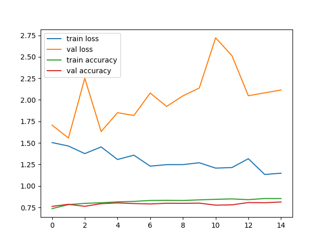
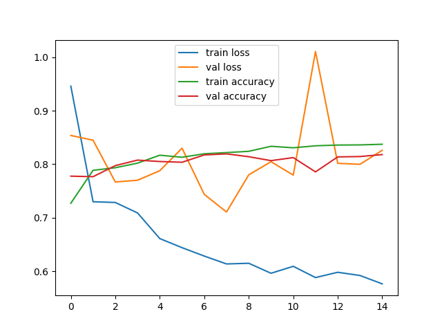
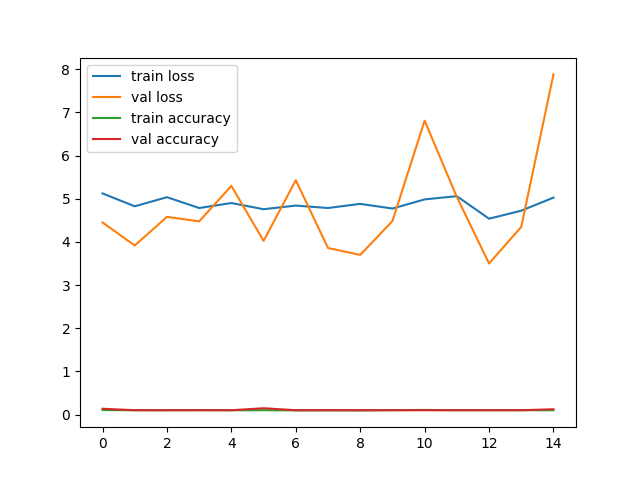

# CIFAR-10 Image Classification Project

This project focuses on image classification using the CIFAR-10 dataset, which is available on [Kaggle](https://www.kaggle.com/datasets/swaroopkml/cifar10-pngs-in-folders). The CIFAR-10 dataset comprises 50,000 images in the training set and 10,000 images in the test set, divided into 10 classes representing various objects. Transfer learning is employed in this project to save time by leveraging pre-trained neural network architectures and achieving satisfactory results quickly.

## Install Dependencies
You can install the required dependencies using the following command:

```shell
pip install -r requirements.txt
```

## Download and Prepare the Dataset
Before training the model, you need to download the CIFAR-10 dataset and place it in the "data" folder. You can download it from [here](https://www.kaggle.com/datasets/swaroopkml/cifar10-pngs-in-folders) and extract the contents into the "data" folder.

```plaintext
- data/
    - 10_class.yaml
    - dataset/
        train/
            - class1/
            ...
            - class10/
        test/
            - class1/
            ...
            - class10/
```


## Downloading Trained Models

To use the pre-trained models for image classification, you'll need to download them and unzip them to the root of your project directory. Follow these steps:

1. **Download the Trained Models**:
   - Click [here](https://drive.google.com/file/d/1Tz6lCzBTNwdp_5-n7WkeoydXZaUgGrzf/view?usp=sharing) to access the trained model file.
   - On the Google Drive page, click the "Download" button to download the ZIP file containing the models.

2. **Unzip the Models**:
   - Once the download is complete, unzip the downloaded ZIP file.
   - You should now have a directory named `models` in your project's root directory. Inside this directory, you'll find the pre-trained model files.

Your project directory should look like this after downloading and unzipping the models:

```plaintext
- cifar-10-image-classification/
    - README.md
    - flask_api.py
    - requirements.txt
    - models/
        - inception.h5
        - other_model_files.h5
    - other_project_files.py
    - ...
```


## Training the Model
To train the model, execute the following command:

```shell
python train.py --data data/10_class.yaml --model inception --name model_run_1
```

### Options:
- `data`: You can modify the `10_class.yaml` file to specify the path to the dataset.
- `model`: You can select the model for transfer learning. Options include `inception`, `xception`, or `efficientnet`.
- `name`: Name of the trained model.

## Making Predictions
To make predictions, use the following command:

```shell
python predict.py --model models/inception_resnet_v2.pt --source data/dataset/unlabeled/0.jpg
```

### Options:
- `model`: Path to the trained model.
- `source`: Path to the input image for prediction.

## Results
Here are the results for different models:

| Model Name         | Train Accuracy | Train Loss | Test Accuracy | Test Loss |
| ------------------ | -------------- | ---------- | ------------- | --------- |
| Xception           | 0.8654         | 1.0467     | 0.8134        | 2.1146    |
| InceptionResNetV2 | 0.8573         | 0.4948     | 0.8180        | 0.8260    |
| EfficientNetB7    | 0.1210         | 7.8884     | 0.1227        | 7.8812    |

### Model Visualizations

- **Xception:**



- **InceptionResNetV2:**



- **EfficientNetB7:**



## Running in Docker

### Build the Docker Image
To build the Docker image, execute the following command:

```shell
docker build -t model .
```

### Run the Docker Image
To run the Docker image, use this command:

```shell
docker run -it --rm model
```

### Accessing the Container
To access the container on your host or server, you can use the following commands:

1. Find the container ID:

```shell
docker ps -q
```

2. Access the container using its ID:

```shell
docker exec -it <container_ID> bash
```

Now you are inside your container and can execute commands.
``
## Using the API

We have provided a Flask API that allows you to perform image classification using the trained model. Follow these steps to use the API:

1. **Setup**: Make sure you have installed the required dependencies mentioned in the project setup section.

2. **Start the API Server**:
    - Open a terminal and navigate to the project directory.
    - Run the following command to start the API server:

    ```bash
    python flask_api.py
    ```

    The API server will start and be accessible at `http://localhost:8080`.

3. **Send POST Requests for Classification**:
    - To classify an image, you need to send a POST request to the `/classify` endpoint.
    - You can use tools like `curl` or create your own client to send requests. Here's an example using `curl`:

    ```bash
    curl -X POST -F "image=@path/to/your/image.jpg" http://localhost:8080/classify
    ```

    Replace `"path/to/your/image.jpg"` with the actual path to the image you want to classify.

4. **API Response**:
    - The API will respond with a JSON object containing the predicted class label. For example:

    ```json
    {"class_label": "car"}
    ```

5. **Shutdown the API**:
    - To stop the API server, press `Ctrl + C` in the terminal where it's running.

Remember to replace `"path/to/your/image.jpg"` with the actual path to your image file.